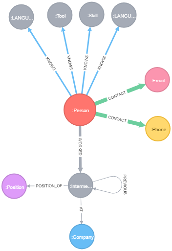

# neo4j-resume

Resume based approach in a graph like fashion.

## About

This is based on a gentle exercise that I created to familiarize myself with an example of graph based modeling. The goal is to answer the following most common questions about any person's resume.

### Questions

1. What is your contact information?
    * How can we reach you?
2. What do you know?
    * What skills, tools, languages, etc do you have?
    * How proficient are you in each?
3. What is your work history?
    * Who have you worked for and are currently working for?
    * What position did you have at each?
    * How long did you hold that position?
4. What is your educational background? (todo)
    * What is your highest form of education?
    * What was your GPA in each?
    * When time frame did you attend?

## Getting Started

1. Spin up a clean Neo4j instance.
2. Execute the [import-resume.cypher script](./import-resume.cypher)
3. Start asking questions of your choice detailed [here](./resume-questions.cypher)

## Schema

After performing Step #1 in Getting Started, you can view the schema with `CALL db.schema()`. This will returns the following schema.

### Thanks

* Modeling with [ACP Jones Arrows](http://www.apcjones.com/arrows/)
* Powered by Cypher and Neo4j 

## Contributing

Feel free to use, extend, and tailor one for needs.

If you have pointers, new ideas, branch out and create a PR.

If you have any questions, message me or throw something in the issues.